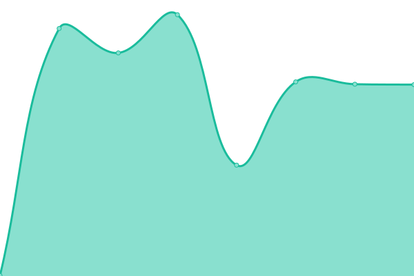

# [📈 Live Status](https://demo.upptime.js.org): <!--live status--> **🟩 All systems operational**

This repository contains the open-source uptime monitor and status page for [Elena Mateos López](https://elenamlopez.github.io/Personal_Web/), powered by [Upptime](https://github.com/upptime/upptime).

With [Upptime](https://upptime.js.org), you can get your own unlimited and free uptime monitor and status page, powered entirely by a GitHub repository. We use [Issues](https://github.com/ElenaMLopez/holafly-status-page/issues) as incident reports, [Actions](https://github.com/ElenaMLopez/holafly-status-page/actions) as uptime monitors, and [Pages](https://demo.upptime.js.org) for the status page.

<!--start: status pages-->
<!-- This summary is generated by Upptime (https://github.com/upptime/upptime) -->
<!-- Do not edit this manually, your changes will be overwritten -->
<!-- prettier-ignore -->
| URL | Status | History | Response Time | Uptime |
| --- | ------ | ------- | ------------- | ------ |
|  [Holafly e-commerce web](https://esim.holafly.com) | 🟩 Up | [holafly-e-commerce-web.yml](https://github.com/ElenaMLopez/holafly-status-page/commits/HEAD/history/holafly-e-commerce-web.yml) | 

 395ms
     
 | 

<a href="https://ElenaMLopez.github.io/holafly-status-page/history/holafly-e-commerce-web">52.20%</a>
    

|  [Shortener](https://holaf.ly) | 🟩 Up | [shortener.yml](https://github.com/ElenaMLopez/holafly-status-page/commits/HEAD/history/shortener.yml) | 

 492ms
     
 | 

<a href="https://ElenaMLopez.github.io/holafly-status-page/history/shortener">35.99%</a>
    

|  [Activaciones](https://activaciones.holafly.com) | 🟩 Up | [activaciones.yml](https://github.com/ElenaMLopez/holafly-status-page/commits/HEAD/history/activaciones.yml) | 

 394ms
     
 | 

<a href="https://ElenaMLopez.github.io/holafly-status-page/history/activaciones">0.78%</a>
    

<!--end: status pages-->

[**Visit our status website →**](https://demo.upptime.js.org)

## 📄 License

- Powered by: [Upptime](https://github.com/upptime/upptime)
- Code: [MIT](./LICENSE) © [Anand Chowdhary](https://anandchowdhary.com), supported by [Pabio](https://pabio.com)
- Data in the `./history` directory: [Open Database License](https://opendatacommons.org/licenses/odbl/1-0/)
